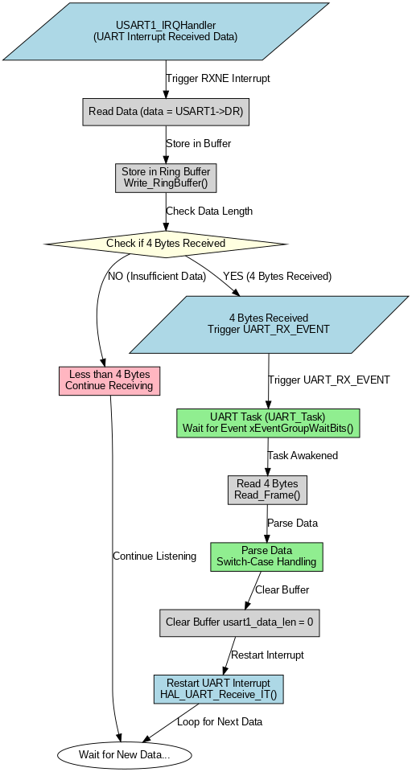
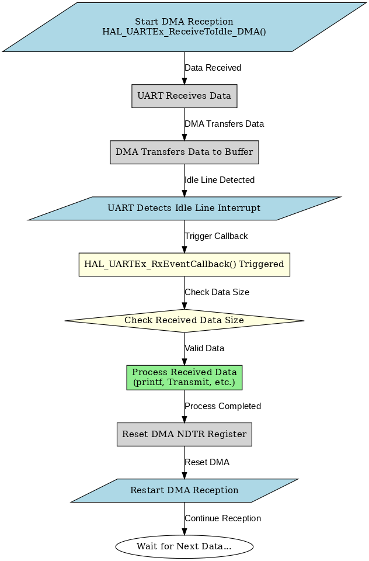
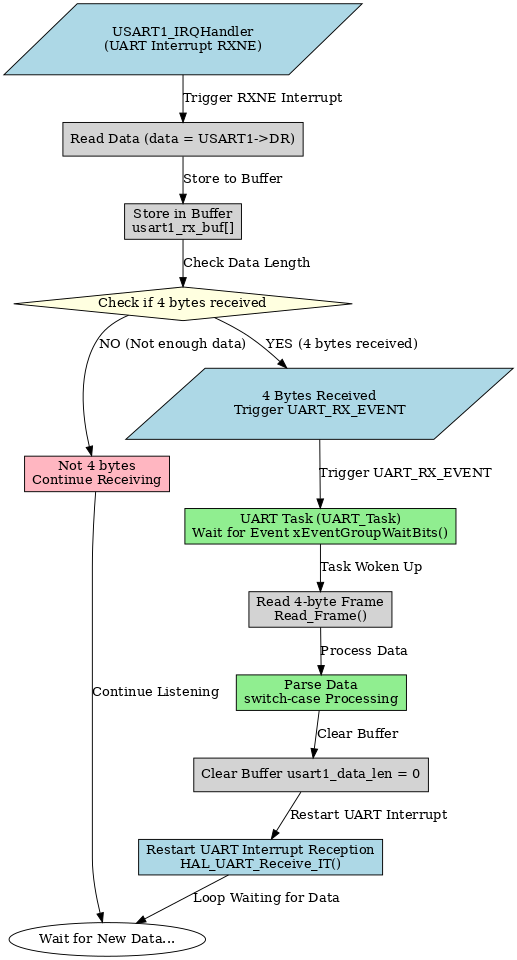

# 串口中断数据丢失

## 串口中断 + 环形缓冲区（固定 字节数据收发）

**适用于：**  
- 串口通信 **每帧固定字节**

- **不会丢数据，FIFO 先进先出**

- **收到完整字节才解析，避免 `switch-case` 误触发**

- 以每帧固定4字节为例

  ---

###  头文件 `ring_buffer.h`

```c
#ifndef __RING_BUFFER_H
#define __RING_BUFFER_H

#include "stm32f1xx_hal.h"

#define RINGBUFF_LEN 64  // 环形缓冲区大小，必须是 4 的倍数（保证完整帧存储）
#define FRAME_SIZE 4  // 每帧固定 4 字节

typedef struct
{
    uint8_t buffer[RINGBUFF_LEN];  // 存储接收到的数据
    volatile uint16_t head;  // 头指针
    volatile uint16_t tail;  // 尾指针
    volatile uint16_t length;  // 当前缓冲区数据长度
} RingBuffer_t;

// 函数声明
void RingBuffer_Init(RingBuffer_t *ringBuff);
uint8_t Write_RingBuffer(RingBuffer_t *ringBuff, uint8_t data);
uint8_t Read_RingBuffer(RingBuffer_t *ringBuff, uint8_t *rData);
uint8_t Read_Frame(RingBuffer_t *ringBuff, uint8_t *frame);

#endif
```

###  环形缓冲区实现 `ring_buffer.c`

```c
#include "ring_buffer.h"

// 初始化环形缓冲区
void RingBuffer_Init(RingBuffer_t *ringBuff)
{
    ringBuff->head = 0;
    ringBuff->tail = 0;
    ringBuff->length = 0;
}

// 向环形缓冲区写入数据
uint8_t Write_RingBuffer(RingBuffer_t *ringBuff, uint8_t data)
{
    if (ringBuff->length >= RINGBUFF_LEN)  // 判断缓冲区是否已满
    {
        return 0;  // 缓冲区已满，写入失败
    }

    ringBuff->buffer[ringBuff->head] = data;  // 存储数据
    ringBuff->head = (ringBuff->head + 1) % RINGBUFF_LEN;  // 防止越界
    ringBuff->length++;

    return 1;  // 写入成功
}

// 从环形缓冲区读取 4 字节数据帧
uint8_t Read_Frame(RingBuffer_t *ringBuff, uint8_t *frame)
{
    if (ringBuff->length < FRAME_SIZE)
    {
        return 0;  // 不足 4 字节，读取失败
    }

    for (uint8_t i = 0; i < FRAME_SIZE; i++)  // 读取 4 字节
    {
        frame[i] = ringBuff->buffer[ringBuff->tail];
        ringBuff->tail = (ringBuff->tail + 1) % RINGBUFF_LEN;  // 环形递增
        ringBuff->length--;
    }

    return 1;  // 读取成功
}
```

### 串口中断 + 环形缓冲区 `main.c`
```c
#include "main.h"
#include "ring_buffer.h"
#include "usart.h"

uint8_t uart_rx_data;  // 串口接收
RingBuffer_t uart_rx_ring;  // 环形缓冲区实例

// 初始化 UART 并开启中断
void UART_Init()
{
    HAL_UART_Receive_IT(&huart1, &uart_rx_data, 1);
}

// 串口接收中断回调
void USART1_IRQHandler(void)
{
    if (__HAL_UART_GET_FLAG(&huart1, UART_FLAG_RXNE)) // 串口收到数据
    {
        uint8_t data = (uint8_t)(huart1.Instance->DR & 0xFF);  // 读取数据
        Write_RingBuffer(&uart_rx_ring, data);  // 存入环形缓冲区
		HAL_UART_Receive_IT(&huart1, &uart_rx_data, 1);
    }
}

// 处理 UART 接收到的数据
void Process_UART_Data()
{
    uint8_t frame[FRAME_SIZE];  // 存储 4 字节数据

    while (Read_Frame(&uart_rx_ring, frame))  // 读取完整 4 字节帧
    {
        switch (frame[0])  // 解析第 1 字节作为指令
        {
            case 0xA1:
                printf("收到 A1 指令，数据：%d %d %d\n", frame[1], frame[2], frame[3]);
                break;
            case 0xB2:
                printf("收到 B2 指令，数据：%d %d %d\n", frame[1], frame[2], frame[3]);
                break;
            default:
                printf("未知指令：%d %d %d %d\n", frame[0], frame[1], frame[2], frame[3]);
                break;
        }
    }
}

// 主函数
int main(void)
{
    HAL_Init();
    SystemClock_Config();
    MX_GPIO_Init();
    MX_USART1_UART_Init();
    RingBuffer_Init(&uart_rx_ring);
    UART_Init();

    while (1)
    {
        Process_UART_Data();  // 处理接收到的数据
        HAL_Delay(10);
    }
}

```




---

## 使用串口空闲中断接收不定长数据

### 方案说明

使用 DMA，在串口接收结束之后会产生空闲中断，在空闲中断里面再把 DMA 的数据搬运到内存。

**特点：**

- **适用于不定长数据的串口通信**
- **避免数据丢失，提高接收效率**
- **基于 DMA 和串口空闲中断 (IDLE IRQ)**

---

###  代码完整示例

#### 定义变量

```c
#include <stdio.h>
uint8_t usart1_rx_buf[1024]={'\0'}; // 1024 是缓冲区的长度
```

#### 开启 DMA 接收空闲中断

```c
HAL_UARTEx_ReceiveToIdle_DMA(&huart1, usart1_rx_buf, sizeof(usart1_rx_buf));
```

#### 添加回调函数

```c
void HAL_UARTEx_RxEventCallback(UART_HandleTypeDef *huart, uint16_t Size)
{
    if(huart == &huart1)
    {
        printf("%s", usart1_rx_buf);
        
        // 另一种方式：
        // usart1_data_len = bufflen - huart->hdmarx->Instance->NDTR; // 获取帧长
        // HAL_UART_Transmit(&huart1, usart1_rx_buf, usart1_data_len, 100);

        // 使 DMA 从头存数据
        huart->hdmarx->Instance->NDTR = 1024;
        
        // 重新打开 DMA 接收，空闲中断
        HAL_UARTEx_ReceiveToIdle_DMA(&huart1, usart1_rx_buf, 1024);
    }
}
```



---

## FreeRTOS `EventFlags` 方案

### 方案说明

1. **UART 触发 `RXNE`（接收非空）中断**

2. **数据存入 `usart1_rx_buf[]`）**

3. **触发 `UART_RX_EVENT` 事件**

4. **UART 任务 `uart_task()` 被唤醒，读取 `usart1_rx_buf[]` 并解析**

5. **循环重复，持续接收数据**

6. 以每帧固定4字节为例

   ---

### 代码完整示例

#### 头文件 `uart_task.h`

```c
#ifndef __UART_TASK_H
#define __UART_TASK_H

#include "FreeRTOS.h"
#include "task.h"
#include "event_groups.h"
#include "stm32f1xx_hal.h"

#define UART_RX_EVENT (1 << 0)  // 事件标志位
#define FRAME_SIZE 4  // 每帧固定 4 字节

extern EventGroupHandle_t uart_event_group;
extern uint8_t usart1_rx_buf[FRAME_SIZE];
extern volatile uint16_t usart1_data_len;

void UART_Task(void *argument);
void UART_Init(void);
void USART1_IRQHandler(void);

#endif
```

------

#### **📌 `uart_task.c`**

```c
#include "uart_task.h"
#include "usart.h"

EventGroupHandle_t uart_event_group;  // 事件组
uint8_t usart1_rx_buf[FRAME_SIZE];  // 串口接收缓冲区
volatile uint16_t usart1_data_len = 0;  // 当前接收到的数据长度

// 串口中断接收数据
void USART1_IRQHandler(void)
{
    if (__HAL_UART_GET_FLAG(&huart1, UART_FLAG_RXNE))  // 串口收到数据
    {
        uint8_t data = (uint8_t)(huart1.Instance->DR & 0xFF);  // 读取数据

        if (usart1_data_len < FRAME_SIZE)  // 确保缓冲区不溢出
        {
            usart1_rx_buf[usart1_data_len++] = data;
        }

        // 当收到 4 字节时，触发事件
        if (usart1_data_len == FRAME_SIZE)  
        {
            xEventGroupSetBits(uart_event_group, UART_RX_EVENT);
        }
    }
}

// UART 任务       
void UART_Task(void *argument)
{
    while (1)
    {
        // 等待串口事件，任务进入阻塞模式
        xEventGroupWaitBits(uart_event_group, UART_RX_EVENT, pdTRUE, pdFALSE, portMAX_DELAY);

        // 处理接收到的数据
        printf("Received: %d %d %d %d\n", usart1_rx_buf[0], usart1_rx_buf[1], usart1_rx_buf[2], usart1_rx_buf[3]);

        // 清空缓冲区
        usart1_data_len = 0;
    }
}

// UART 初始化
void UART_Init(void)
{
    uart_event_group = xEventGroupCreate();  // 创建事件标志组

    HAL_UART_Receive_IT(&huart1, (uint8_t *)NULL, 1);  // 启动串口中断
}
```

------

#### **📌 `main.c`**

```c
#include "main.h"
#include "cmsis_os.h"
#include "uart_task.h"

// 主函数
int main(void)
{
    HAL_Init();
    SystemClock_Config();
    MX_GPIO_Init();
    MX_USART1_UART_Init();

    UART_Init();
    
    // 创建 UART 任务
    osThreadDef(UART_Task, UART_Task, osPriorityNormal, 0, 128);
    osThreadCreate(osThread(UART_Task), NULL);

    // 启动调度器
    osKernelStart();

    while (1);
}
```


